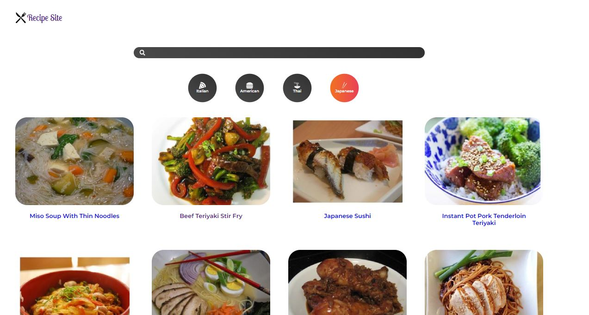
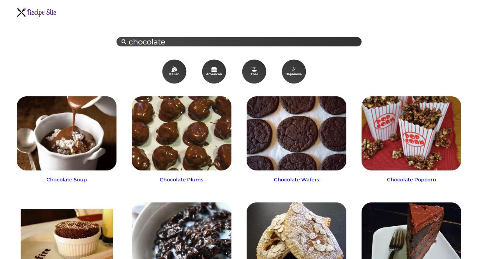
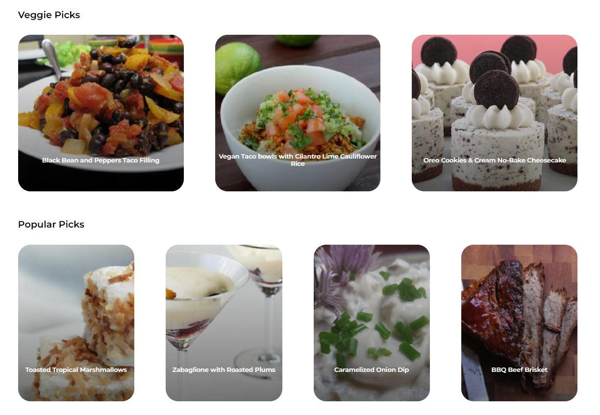
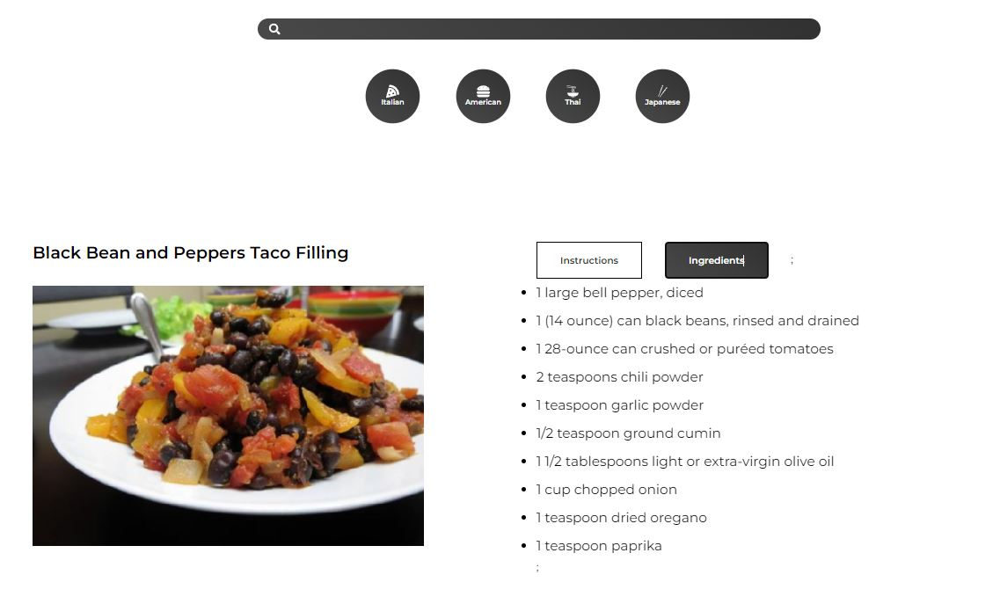

# Recipe Site

This repository consists of a recipe website developed to practice using the React JavaScript UI library. The recipes are loaded in using the Spoonacular API ([link here](https://spoonacular.com/food-api)). Please note that if you wish to try to run the source code on your machine, you will need to add your own API key by saving it in a .env file in the root of this directory. 

## Structure

The website consists of a single static header containin a logo, search bar and category select. Underneath this area, different pages are loaded in asynchronously depending on the user's selection. To avoid an overwhelming number of API calls, data relating to randomly selected recipes is saved down in local storage and retrieved if the user refreshes the page.

## Categories
---
As can be seen below, the user may select a category of food, upon which a random selection of that food type will be displayed on the screen.

---

## Search Bar
---
The user may type in a search parameter, and the website will display recipes relating to that search. 

---
## Splash Page
---
The splash page contains randomly selected recipes, both vegetarian and not. 

---
## Recipe Details
---
Each recipe image links to a display of the recipe details and ingredients. Two buttons are provided to toggle between the requested information.

---
*Many thanks to Dev Ed's introduction to React video, which was used to help create this website: [link here](https://www.youtube.com/watch?v=xc4uOzlndAk).*